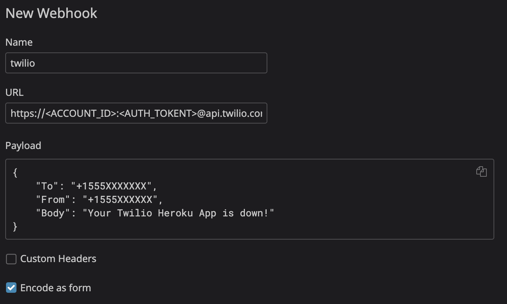

## Monitoring your Twilio app with Datadog and Twilio

With Twilio's Annual [Signal Conference](https://signal.twilio.com/) having come to a conclusion October 1st, we thought it would be fitting to create an update to [our last blog post on Twilio with Datadog](https://www.datadoghq.com/blog/send-alerts-sms-customizable-webhooks-twilio/).

In this blog post, we will outline how to use Datadog's comprehensive [Synthetics suite](https://docs.datadoghq.com/synthetics/) to monitor your Twilio app's endpoints, as well as using the power of Twilio's API to send alerts through SMS on your monitors via [Webhooks](https://docs.datadoghq.com/integrations/webhooks/#overview). Where, once completed, we will use a Twilio notification to notify us if our Twilio app goes down.

### Getting Started With Your Twilio App

If you are reading this, we suspect you already have a Twilio app deployed and ready to go. As such, we decided to follow [this "Hello, World!" style app using Twilio, Heroku and Python](https://www.twilio.com/blog/2017/02/stripe-sms-notifications-via-twilio-heroku-and-python.html) as a simple starting place. This gives us the starting point of a Flask app deployed on Heroku that will respond back to any number that texts it. We stopped with the code block that reads:
```python
import os
from flask import Flask, request
from twilio.rest import Client

app = Flask(__name__)

# Find these values at https://twilio.com/user/account
account_sid = os.environ['TWILIO_ACCOUNT_SID']
auth_token = os.environ['TWILIO_AUTH_TOKEN']
client = Client(account_sid, auth_token)

@app.route("/", methods=['POST'])
def receive_order():
    message = client.messages.create(
        to=os.environ['PHONE_NUMBER'],
        from_=os.environ['TWILIO_NUMBER'],
        body="Hello, World!")
    return '', 200

if __name__ == "__main__":
    port = int(os.environ.get("PORT", 5000))
    app.run(host='0.0.0.0', port=port)
```

Now that we have that set up, we can add this endpoint to a Datadog Synthetics test. To start, navigate to [this page](https://app.datadoghq.com/synthetics/create), which will bring up the **New API Test** page. Here we will create a test emulating a real world call to our app's endpoint and recording the response for our monitoring purposes. Let's go through the following options from top to bottom:


#### 1. Choose request type

We are going to keep this as HTTP, as this is what a Twilio API call would look like if you were to text the app anyway.

#### 2. Define request

Change `GET` to `POST`, and then copy the URL of the endpoint you have already put into Twilio for their SMS. Again, this will emulate what a real text will look like to your app.


If we look into advanced options, we can see there are plenty of other sections we could fill out. For example, if your Twilio app's response depending on the input from the HTTP request, you could add the respective headers or body with a sample request. However, as the app we are working on right now requires no headers or body, we can set this to `None` and leave everything else blank.


If you would like to change the name of your test, you may do it here. You can also [set tags](https://docs.datadoghq.com/getting_started/tagging/) here to help organize your tests and services if you have a robust Datadog setup.

For the **Locations** section, every single region checked will send a test to your app. This will result in Twilio calls being made, and responses being sent, which is important to keep in mind. There is also an option to use a [private Synthetics test location](https://www.datadoghq.com/blog/private-synthetic-monitoring/).

#### 3. Specify test frequency

The frequency section is exactly what it sounds like: how often the test is performed. As every test will send a SMS, setting it relatively infrequently is likely safe, but if you know that consistent testing is important, you have the power to change it as needed. It is also important to keep in mind that you have the ability to [pause testing and manually start a test](https://docs.datadoghq.com/synthetics/search/#action-tray-options) whenever you would like.


#### 4. Define assertions

This is where we define what constitutes a successful test. In this case, we are defining a success as when we get a response containing a status code of 200, or `OK` back from the endpoint. You are free to change this to any combination of assertions that you would like.

#### 5. Define alert conditions

We are keeping this section as is for now in order to get an alert immediately after a failed test, but please change this to your personal needs.

Section 6 will be discussed after we set up webhooks in the next section.

### Setting up webhook notifications with Twilio

Now that we have a test set up, we want a way to be notified outside of the Datadog platform when something unexpected happens. As we are already using Twilio in this app, why not get a notification through a SMS?

Thankfully, we already have documentation [outlining how to set up our webhook integration with Twilio](https://docs.datadoghq.com/integrations/webhooks/#sending-sms-through-twilio). It requires a few steps, which we will run through now.



1. Navigate to [the Webhooks Integration tile](https://app.datadoghq.com/account/settings#integrations/webhooks) and create a new Webhook.

2. **Name** the webhook whatever you would like. In this case we chose "twilio".

3. Under **URL** add in the url: 
    `https://<ACCOUNT_ID>:<AUTH_TOKENT>@api.twilio.com/2010-04-01/Accounts/<ACCOUNT_ID>/Messages.json`
    replacing `<ACCOUNT_ID>` and `<AUTH_TOKEN>` with the respective data from [your Twilio console](https://twilio.com/user/account). Please note you need to fill in `<ACCOUNT_ID>` twice in this URL.

4. Under **Payload**, add the code below, replacing the "To" number with the phone number you want the alert to go to, and "From" with your Twilio phone number. Customize the "Body" with what you would like sent in the text. You can even add in [custom fields directly from Datadog](https://docs.datadoghq.com/integrations/webhooks/#usage).
```json
{
    "To": "+1347XXXXXXX",
    "From": "+1347XXXXXX",
    "Body": "<YOUR_MESSAGE_HERE>"
}
```

5. Check the **Encode as form** checkbox.

6. Save your webhook.

This will now give us an [option to @ notify our Twilio webhook](https://docs.datadoghq.com/monitors/notifications/?tab=is_alert#notification) in our Synthetics Test we previously created. As shown in the earlier screenshot, we can add `@webhook-twilio` to call our Twilio webhook, as well as add any message we would like shown in Datadog.

### Get started with your own Twilio + Datadog solution

As mentioned before, this is just a simple demonstration of what you are able to do with Datadog Synthetics and Webhooks. To learn more, take a look at some of our other blog posts including [Incorporating Datadog Synthetic tests into your CI/CD pipeline](https://www.datadoghq.com/blog/datadog-synthetic-ci-cd-testing/), and [Managing integrations via API calls](https://www.datadoghq.com/blog/programmatically-manage-your-datadog-integrations/). If you are already using Datadog and Twilio, start using [Synthetics](https://app.datadoghq.com/synthetics/list) and [Webhooks](https://app.datadoghq.com/account/settings#integrations/webhooks) If not, [sign up for a free trial here](placeholder).
